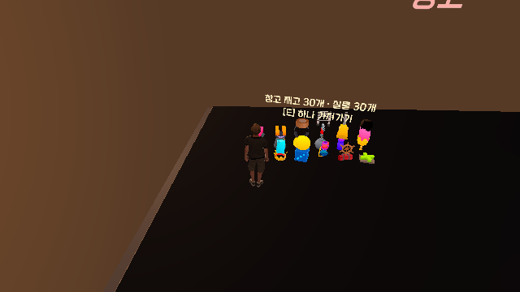
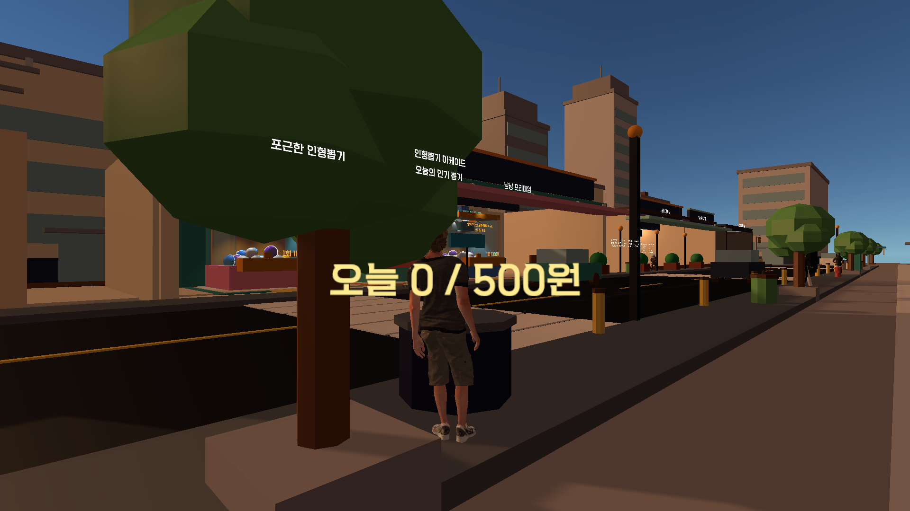
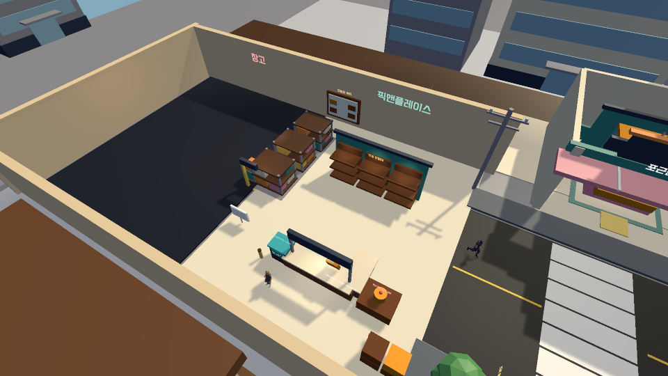
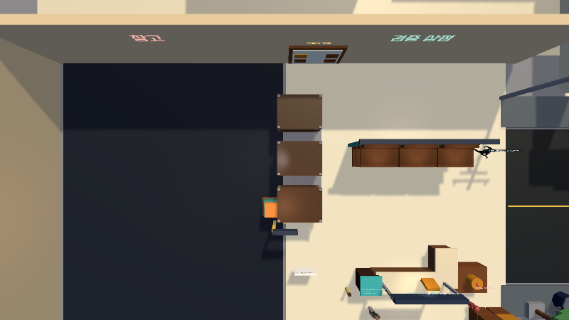
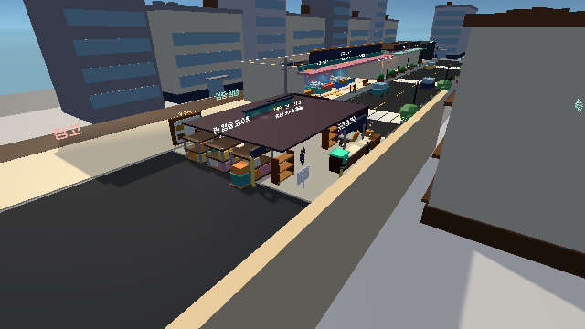

# 물리 충돌 · NPC 경로 · 상호작용 정비 검증 보고서

- 검증일: 2026-08-10
- 대상 씬: `Assets/PickAndPlaceShop/Scenes/PickAndPlaceShop_MainStreetSlice_Multiplayer.unity`
- Unity: 6000.4.6f1
- 판정 기준: Unity Editor Play Mode, Host Authority
- 빌드: 지시서에 따라 생성하지 않음

## 결과 요약

| 파트 | 결과 | 핵심 확인 |
|---|---|---|
| A. R 인형 회수 제거 | 완료 | R 입력·RPC·표시 경로 제거, 다른 R 기능 유지 |
| B. 경찰 회전 | 완료 | 실제 이동 벡터 기준 회전, 세 방향 접근 확인 |
| C. 창고 실물 충돌 | 완료 | 30개 실물에 Host 물리/Client 프록시, 상호작용 Trigger 분리 |
| D. 쓰레기통 | 완료 | 실제 렌더러 위치로 이동, 충돌/상호작용/일 500원 수익 연결 |
| E. Zone_Warehouse NPC 경로 | 완료 | NavMesh 부재 진단, 공용 물리 우회·실패 복구 적용 |

## PART A — R 인형 회수 제거

- 기존 위치: `ShopPlayerTheftNetwork`의 R 입력 → 회수 RPC → 상품 회수 처리.
- 처리: 입력만 남겨 우회 호출될 수 있는 형태가 아니라 R 전용 RPC·회수 흐름과 프롬프트를 함께 제거했다.
- 유지한 R 기능: 관리 화면 닫기 및 Shooter Reload 등 인형 회수와 무관한 입력.
- Play Mode에서 개인 인벤토리, 공용 창고, 공용 진열을 각각 연 상태로 R을 눌렀으며 상품 수량/상태 변화가 없었다.

## PART B — 경찰 회전

- 이전 수정의 문제: 외형 Yaw 보정값 180도가 실제 진행 방향을 뒤집어 `forward·velocity = -1`이 됐다.
- 최종 처리: 외형 보정값을 0도로 확정하고, 권한 경찰의 실제 이동 벡터를 기준으로 Y축만 부드럽게 회전한다.
- 세 방향 접근 테스트에서 최종 진행 방향 일치도는 `forward·velocity = 1.000`이었다.
- 최대 확장 회귀에서 경찰을 강제 출동시켜 장애물 반대편으로 플레이어를 이동시켰고, 추격 중 측정값은 `facing dot 0.849`, 거리 3.46m였다. 이어서 경찰이 플레이어에게 정상 도달해 추격이 종료됐다.

## PART C — 창고 인형 물리 충돌

- 구성: 상품별 실물 Root에 비 Trigger 충돌체 + Host Rigidbody, 별도 자식 Trigger에 기존 E 상호작용을 유지했다.
- Host: 동적 Rigidbody로 가볍게 밀리며, 영역 이탈 시 창고 안쪽으로 회복한다.
- Client: 동일 위치를 표시하는 Kinematic 프록시로 두어 권한별 물리 발산을 막았다.
- 최대 표시 수: 30개.
- 213.79초 관찰 결과: 수면 해제 0, 최대 속도 0, 상호 침투 0쌍.
- 플레이어가 1.5m 전진했을 때 실제 이동량 0.402m 및 `CollisionFlags.Sides|Below`를 확인했다.
- E 수집 회귀: 공용 창고 30→29, 개인 인벤토리 0→1.

## PART D — 쓰레기통

- 원인: 상호작용 Root 좌표가 `(-61.18, 0, 20.58)`인데 렌더러 중심은 `(17.73, 0.45, -5.98)`여서 충돌체와 안내 글자가 약 80m 떨어져 있었다.
- 처리: 렌더러 Bounds를 기준으로 런타임 Root, 비 Trigger 충돌체, NavMeshObstacle, 자식 상호작용 Trigger, Billboard 라벨을 일관되게 배치했다.
- E와 공격은 모두 `ShopNetworkGame.ServerTryTrashSearch` 단일 진입 함수를 사용한다.
- 보상 데이터: 25~100원, 쿨다운 2.5초, 일일 상한 500원.
- 20회 보상 실측 범위: 27~99원.
- 상한 테스트: 490원 상태에서 10원만 지급되어 500원, 다음 시도는 0원.
- 일차 1→2 전환 시 321→0 리셋. 같은 날 저장 복원 321, 지난 일차 저장은 0으로 안전 복원.

## PART E — Zone_Warehouse NPC 경로

### 실제 관찰과 원인

- 수정 전에는 여러 손님이 동일 좌표 `(11.15, 0.14, 3.22)`에 겹쳐 멈췄고 목표는 `(6.40, 0.05, 5.20)`이었다.
- 씬의 `NavMesh.CalculateTriangulation()` 결과는 정점 0개였고 `SamplePosition`도 실패했다. 즉 이 생성 씬에는 사용할 수 있는 NavMesh가 없었다.
- 손님/알바는 CharacterController 직접 이동이며, 기존 로직은 막혀도 12초 뒤 목적지에 도착한 것으로 간주하거나 알바를 작업 위치 옆으로 순간 이동시켰다.
- `Zone_Warehouse`에는 랙/상자 기준 비 Trigger 충돌체 44개가 있었으므로 충돌체를 없애지 않고 우회해야 했다.

### 경로 확보와 실패 복구

- `ShopNpcRoutePlanner`를 손님·알바·경찰이 함께 사용한다.
- NavMesh가 있으면 Complete 경로의 다음 Corner를 사용한다.
- 이 씬처럼 NavMesh가 없으면 CapsuleCast로 실제 막는 충돌체를 찾고, 장애물 Bounds 바깥 후보점을 순서대로 평가해 물리 우회점을 만든다.
- 1.1초 동안 진행이 없으면 새 우회점을 시도한다.
- 손님: 다른 진열/검사 지점 → 포기/퇴장 → 안전 Despawn 순서.
- 알바: 다른 우회 시도 후 출입구 안전 지점으로 걸어가 잠시 대기하고 작업지를 다시 선택한다. 순간 이동은 제거했다.
- 경찰: 이동 중 정체를 감지해 다른 물리 우회점으로 갱신한다.
- 이미 포기 통계가 기록된 손님도 다시 막히면 통계는 중복시키지 않고 `GiveUp` 상태로 전환하도록 보완했다.

### 장시간/회귀 검증

- 기본 확장: 213초 이상 연속 관찰. 방문 16, 실제 계산 1건/480원, 알바 3명 유지. 관찰 종료 시 활성 손님 0명으로 모든 개체가 목적지 처리 또는 안전 퇴장했다.
- 최대 확장: 3분 이상 연속 관찰. 12명 동시 생성 후 창고 주변 고정/회전 0, 벽 관통 0. 별도 표본에서 활성 5명에 대해 Zone_Warehouse 충돌체 220쌍을 검사해 침투 0쌍이었다.
- 폐쇄 경로 시험: 고객을 네 벽 안에 둔 뒤 이미 포기 통계가 기록된 조건에서도 `Browse → GiveUp → 안전 Despawn`으로 종료했다.
- 알바: Stocker/Cashier/Collector 3명이 각 작업지 및 안전 지점을 이동했고 Zone_Warehouse 충돌체 132쌍 검사에서 침투 0쌍이었다.
- 경찰: 경로 우회 후 플레이어 도달, 회전·추격 종료 정상.
- 기본 확장에서 진열 접근, 대기열 진입, 실제 계산 1건을 완료해 판매 흐름 회귀를 확인했다.
- 최종 Console Error 0건, Warning 0건.

## 기존 시스템 회귀

- 상품 구매/판매: 실제 계산 1건, 480원 정상 반영.
- 계산대 E 흐름: 계산 프롬프트 생성 및 완료 정상.
- 알바: 3개 역할 생성·이동·업무 상태 유지.
- 창고 적재/E 수집: 30→29 및 개인 인벤토리 0→1.
- 저장/불러오기: 쓰레기통 일일 누적만 같은 일차에 복원, 지난 일차 값은 리셋.
- Host Authority: 물리 인형과 수익 지급은 Host만 결정하고 Client는 결과만 표시.

## 보류·실패

- 없음.
- 지시서에 따라 이번 배치에서는 Player/WebGL 빌드를 만들지 않았다.

## 가정

- NavMesh가 없는 현재 생성 씬 구조를 유지하고, 충돌체를 제거하거나 NPC가 통과하게 만들지 않는 것을 우선했다.
- 경로 실패 간격 1.1초, 손님 대체 경로 1회 후 안전 퇴장, 알바 안전 지점 대기 3초를 사용했다.
- 장시간 검증 중 테스트를 위해 확장/알바/손님 상태를 Host 런타임에서만 강제했으며 씬 파일에는 저장하지 않았다.
