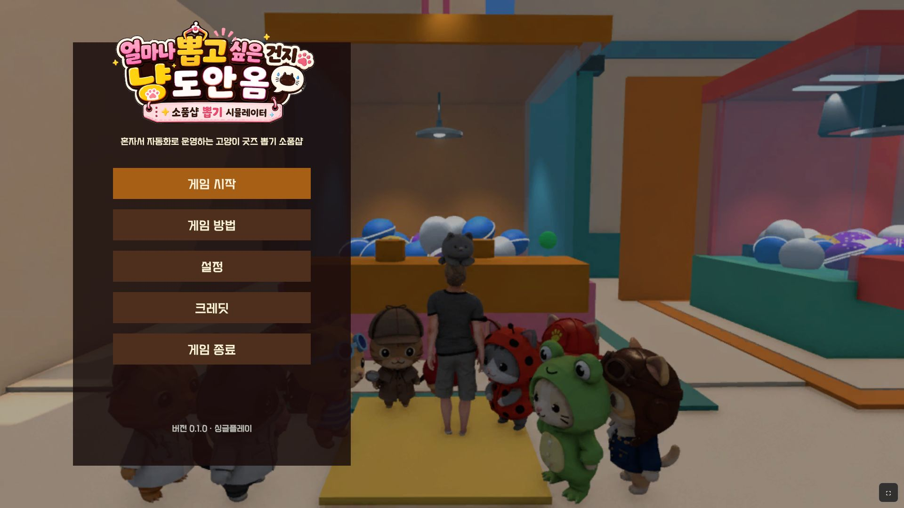
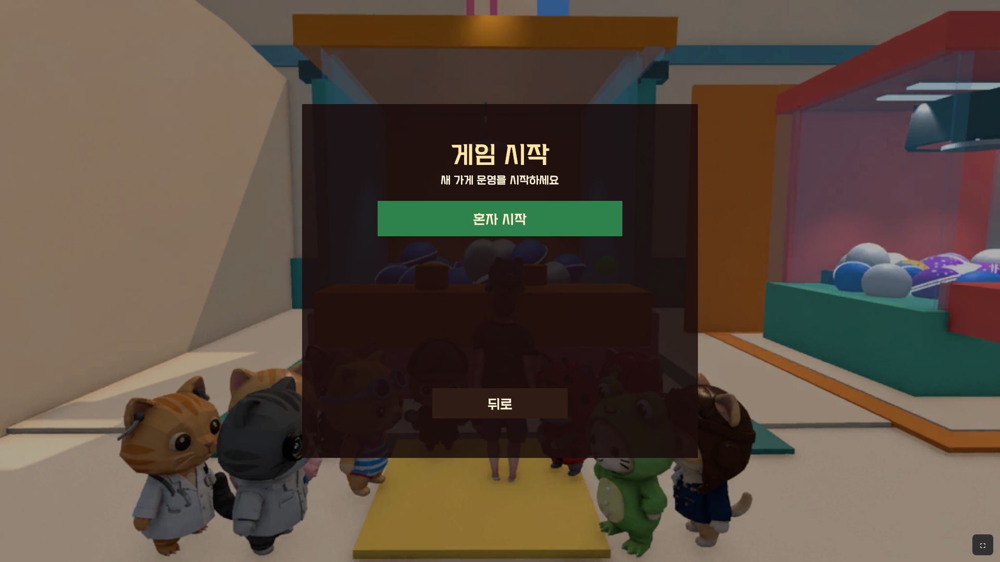

# 공개 GitHub Pages 플레이 검증 보고서

- 검증 일자: 2026-08-10 (KST)
- 공개 URL: <https://jiwon8899.github.io/Toygame/>
- 검증 대상 커밋: `f75abdb91b4df152bd206b242baf8a50c73735a3`
- 검증 조건: 쿼리 파라미터 없음, 공개 인터넷, 새 브라우저 세션, 최초 방문 후 저장/새로고침/이어하기
- 코드·에셋·빌드 설정 변경: 없음

## 1. 최종 판정

**조건부 제출 가능**

데스크톱 심사 환경인 1920×1080과 1366×768에서는 로딩, 타이틀 표시, 싱글플레이 진입, 저장, 새로고침 후 이어하기, WASD/E/I 입력이 정상 동작했다. 최우선 조건인 이어하기 직후 `NullReferenceException`은 60초 관찰 동안 0건이었다.

다만 모바일 390×844 에뮬레이션에서는 타이틀 메뉴가 화면 왼쪽으로 잘려 일부 글자와 버튼을 온전히 읽을 수 없었다. 모바일은 참고 항목이지만, 모바일 공개도 고려한다면 개선이 필요하다. WebGL 환경에서 여러 미지원 셰이더와 초기 오디오 메타데이터 경고도 확인되었으나 이번 플레이 경로를 차단하지는 않았다.

## 2. PART A — 배포 산출물 무결성

| URL | 상태 | Content-Length | Content-Type | Content-Encoding |
|---|---:|---:|---|---|
| `/Toygame/` | 200 | 6,290 | `text/html; charset=utf-8` | 없음 |
| `/Toygame/index.html` | 200 | 6,290 | `text/html; charset=utf-8` | 없음 |
| `/Toygame/Build/docs.loader.js` | 200 | 47,866 | `application/javascript; charset=utf-8` | 없음 |
| `/Toygame/Build/docs.framework.js.unityweb` | 200 | 99,055 | `application/vnd.unity` | 없음 |
| `/Toygame/Build/docs.wasm.unityweb` | 200 | 17,727,259 | `application/vnd.unity` | 없음 |
| `/Toygame/Build/docs.data.unityweb.parts.json` | 200 | 408 | `application/json; charset=utf-8` | 없음 |
| `/Toygame/Build/docs.data.unityweb.part000` | 200 | 94,371,840 | `application/octet-stream` | 없음 |
| `/Toygame/Build/docs.data.unityweb.part001` | 200 | 75,792,260 | `application/octet-stream` | 없음 |

`index.html`을 파싱해 위 실제 파일명을 확인했다. 두 데이터 청크를 공개 서버에서 새로 내려받아 `part000 → part001` 순서로 결합했다.

- 결합 크기: **170,164,100 bytes**
- 공개 청크 결합 SHA-256: `bd88c9addb5123398747d092ccf1b5650216f00ae7592d5c5146189a70b97113`
- 로컬 `docs/Build/docs.data.unityweb.parts.json` 해시: 동일
- 판정: **크기와 SHA-256 모두 일치**

`Content-Encoding`은 전 파일에서 없었다. 현재 빌드의 Decompression Fallback 경로로 실제 로딩이 완료되었으므로 이 헤더 상태 자체는 차단 문제가 아니었다. WASM 응답은 일반적인 `application/wasm`이 아닌 `application/vnd.unity`였으나 Unity 로더가 정상 처리했다.

## 3. PART B-2 — 최초 로딩

- 공개 URL 최초 접속부터 타이틀 표시까지: **13.311초**
- 진행바: 100% 도달 후 숨김
- 관찰된 정지 구간: 없음
- 로딩 실패/브라우저 오류 팝업: 없음



## 4. PART B-3 — 폰트

판정: **로컬 참조와 동일해 보임**

공개 타이틀의 둥글고 개성 있는 한글 획이 로컬 참조 `PART_G_webgl_default_url.png`와 육안상 동일했다. 콘솔에서도 다음 초기화 로그를 확인했다.

```text
[GlobalGameFont] READY legacy=GFCRedSpirit-Medium tmp=GFCRedSpirit-Medium SDF source=GFCRedSpirit-Medium population=Dynamic multiAtlas=True
```

- TMP 관련 warning/error: **0건**
- 폰트 판정 한계: 이미지 및 초기화 로그 기반이며 렌더링된 각 글리프의 바이너리 비교는 수행하지 않음

| 로컬 WebGL 참조 | 공개 GitHub Pages |
|---|---|
| `PART_G_webgl_default_url.png` | `PublicPages_2026-08-10/public_1920_title.png` |

## 5. PART B-4 — 게임 진입

| 단계 | 결과 |
|---|---|
| 타이틀 → 게임 시작 | 정상 |
| 게임 시작 → 혼자 시작 | 정상 |
| 신규 게임 가게 이름 입력 | 영문 `PUBLIC`, `RIVALI` 입력 후 진행 정상 |
| 메인 게임플레이 씬 | 정상 진입 |
| HUD | 1일차·준비 2:00, 자금 0원, 평판 0, 튜토리얼 1/7 표시 정상 |
| 가게 이름 간판 | `PUBLIC` 반영 확인 |



자동화에서 문자 키를 한 글자씩 주입할 때 `I`/`Tab` 전역 단축키가 이름 입력 UI 위에서 반응해 인벤토리/가게 현황이 열리는 현상이 있었다. 입력 필드의 문자는 유지됐고 UI를 닫은 후 정상 진행했다. 실제 OS 한글 IME 조합 입력과 동일한 재현 방식은 아니므로 수동 한글 입력 여부는 실기 확인 항목으로 남긴다.

## 6. PART B-5 — 이어하기 및 NullReferenceException

검증 절차:

1. 1일차 준비 상태에서 ESC 메뉴의 `저장` 선택
2. `진행 상황을 저장했습니다.` 알림 확인
3. 같은 공개 페이지 새로고침
4. `게임 시작 → 혼자 시작 → 이어하기` 선택
5. 게임플레이 진입 후 이동과 인벤토리 열기/닫기를 섞어 **60초** 관찰

결과:

- 이어하기 진입: 정상
- 저장된 가게 이름 `PUBLIC`: 복원 확인
- 자금: 저장 전 0원 → 이어하기 후 0원
- 개인 인벤토리: 저장 전 0/10 → 이어하기 후 0/10
- 공용 창고: 저장 전 0/30 → 이어하기 후 0/30
- 공용 진열: 저장 전 0/10 → 이어하기 후 0/10
- `NullReferenceException`: **0건**
- `memory access out of bounds`: **0건**
- 기타 런타임 예외: **0건**

이번 세이브가 신규 시작 직후의 빈 상태였으므로, 비어 있지 않은 진열 상품·창고 수량 복원은 이번 세션에서 별도로 증명하지 못했다.

## 7. PART B-6 — 콘솔 오류·경고

### 제출 차단 오류

없음.

### 비치명 경고/로그

| 구분 | 메시지 | 비고 |
|---|---|---|
| 기존 알려진 경고 | `Shader 'Hidden/Universal Render Pipeline/Edge Adaptive Spatial Upsampling' is not supported (in 'Blit FSR Upscaling'). PostProcessing render passes will not execute.` | `warn` 1건, 진행 가능 |
| 새로 관찰 | `Hidden/CoreSRP/CoreCopy shader is not supported on this GPU` | Unity `log` 스트림, 진행 가능 |
| 새로 관찰 | `Hidden/VoxelizeShader shader is not supported on this GPU` | Unity `log` 스트림, 진행 가능 |
| 새로 관찰 | `Hidden/Universal Render Pipeline/StencilDitherMaskSeed shader is not supported on this GPU` | Unity `log` 스트림, 진행 가능 |
| 새로 관찰 | `Hidden/Universal/HDRDebugView shader is not supported on this GPU` | Unity `log` 스트림, 진행 가능 |
| 새로 관찰 | `Hidden/VFX/DeathSparksGraph/Hit Circle/Hit Circle shader is not supported on this GPU` | Unity `log` 스트림, 해당 VFX 경로 미실행 |
| 새로 관찰 | `Hidden/VFX/DeathSparksGraph/Cube Dissolve/Cube Dissolve shader is not supported on this GPU` | Unity `log` 스트림, 해당 VFX 경로 미실행 |
| 새로 관찰 | `Trying to get length of sound which is not loaded yet.` | 초기 오디오 로드 중 |
| 새로 관찰 | `Trying to get metadata of sound which is not loaded.` | 초기 오디오 로드 중 |

위 셰이더 메시지는 브라우저 자동화 환경의 `WebKit WebGL` 렌더러에서 발생했다. 실제 플레이 진입·UI·저장·이어하기는 계속 동작했지만, 해당 효과가 필요한 전투/VFX 장면은 별도 육안 확인이 필요하다.

## 8. PART B-7 — 입력·조작

| 입력 | 결과 |
|---|---|
| WASD | 정상. 캐릭터가 업그레이드 단말 앞에서 계산대 방향으로 이동함 |
| E | 정상. 업그레이드 단말 상호작용으로 `상점 업그레이드` UI가 열림 |
| I | 정상. 개인 인벤토리/공용 창고/공용 진열 UI가 열림 |
| 마우스 클릭 | 타이틀, 혼자 시작, 이름 확정, 저장, 이어하기 버튼 정상 |
| 캔버스 포커스 | 검증 중 캔버스 밖으로 클릭이 새거나 키 입력이 상실되는 현상 미관찰 |

## 9. PART C — 화면 크기별 결과

| 뷰포트 | 결과 | 판정 |
|---|---|---|
| 1920×1080 | 타이틀, 게임 시작 모달, HUD, 퀵슬롯이 화면 안에 표시됨 | 정상 |
| 1366×768 | 타이틀 버튼과 텍스트가 모두 읽히고, 게임플레이 HUD/퀵슬롯이 화면 안에 표시됨 | 정상 |
| 390×844 모바일 에뮬레이션 | 게임 캔버스는 세로 화면을 채우지만 타이틀 메뉴가 왼쪽으로 잘려 로고·버튼 텍스트 일부를 읽기 어려움 | 개선 필요 |

브라우저 자동화 세션에서 세 해상도를 모두 육안 확인했다. 자동화 도구의 파일 저장 제한으로 저장소에 영구 보존된 스크린샷은 1920×1080 타이틀과 게임 시작 화면 2장이다. 1366×768 및 390×844 화면은 검증 세션 출력으로 확인했으나 별도 PNG로 보존하지 못했다.

## 10. 발견된 문제 목록

| 심각도 | 문제 | 원인 후보 |
|---|---|---|
| 개선 권장 | 모바일 390×844에서 타이틀 메뉴 왼쪽 잘림 | 고정 폭/고정 앵커 기반 타이틀 패널, 모바일 종횡비 대응 부족 |
| 개선 권장 | 이름 입력 중 `I`/`Tab` 같은 전역 단축키가 자동화 입력에 반응 | TMP_InputField 포커스 중 전역 입력 모드 차단 누락 가능성. OS 한글 IME 수동 재확인 필요 |
| 개선 권장 | WebGL에서 미지원 셰이더 로그 다수 | WebGL 빌드에서 불필요한 셰이더 스트리핑 부족 또는 해당 셰이더의 WebGL 패스 미지원 |
| 개선 권장 | 초기 오디오 메타데이터 조회 경고 | 스트리밍 오디오 로드 완료 전 길이/메타데이터 접근 |
| 무시 가능 | WASM Content-Type이 `application/vnd.unity` | 실제 Unity 로더가 정상 처리했고 플레이까지 완료 |

제출 차단 문제는 이번 검증 범위에서 발견되지 않았다.

## 11. 사용자 실기기 확인 항목

- 실제 Android/iOS 기기에서 390×844 전후 세로 화면의 타이틀 레이아웃
- 실제 터치 조작 가능 여부(이번 검증은 레이아웃 에뮬레이션만 수행)
- OS 한글 IME로 내 가게/라이벌 가게 이름 입력 시 전역 단축키 간섭 여부
- 비어 있지 않은 인벤토리·창고·진열 데이터를 만든 뒤 저장/이어하기 복원
- 실제 GPU/브라우저에서 DeathSparks VFX와 Voxelize 관련 효과가 필요한 장면
- Chrome/Edge 일반 사용자 프로필에서 첫 방문 다운로드 시간과 사운드 자동재생 정책
